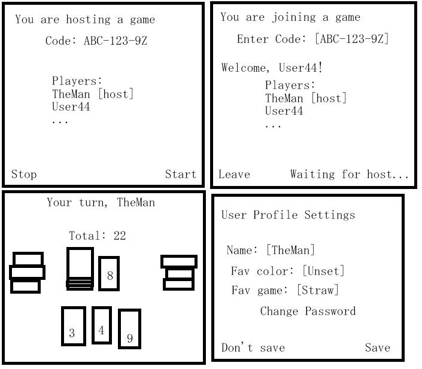

= Not Too High

== Elevator Pitch
This application is specifically for my mother. She is a math teacher who specializes in
early childhood education, and has been exploring card games as a means of "learn-by-play".

Unfortunately her favorite example is out of print, but no worries - I can recreate it as
an online experience, and even have some other games of the same format too!

"Same format"? Oh, yeah, each of these games will follow the following format:
* Each player always has some amount of cards in their hand, usually around 4.
* Players must play cards that add to an invisible value that everyone keeps track of. (Addition yay!)
** ...this is done automatically in this web version.
* Going above a set value (maybe 50 or 99) is bad. Very bad. Don't do that.

=== Games to be featured
* Straw (Mom's favorite. High priority!) (https://boardgamegeek.com/thread/2695471/card-distribution[card distribution])
* Double Down / Loco 77 (Funny premise. Medium priority) (https://web.archive.org/web/20240523203241/https://blog.amigo-spiele.de/content/ap/rule/03910-GB-AmigoRule.pdf[rules and card distribution])
* Ninety Nine (The original. Medium priority) (https://bicyclecards.com/how-to-play/99-ninety-nine/[rules])
* Zeus on the Loose (Low priority) (https://world-of-board-games.com.sg/docs/Zeus-On-the-Loose.pdf[rules and card distribution])
* ONO 99 (Low priority)
* Boom-O (Just fives and tens? Lowest priority.) (https://archive.org/details/manualsbase-id-160626[rules and card distribution])

== Design

== Key Features
* Code-based rooms (borrowed from my last 260 startup attempt)
* Decide between cards in your hand
* 

== Technologies
* HTML: One page for account customization, one page for hosting or joining a game, one page for the game itself.
* CSS: Well how else do you expect me to make the cards look like cards?
* React: Provides login and cards.
* Service: Most of the game logic is kept server-side to prevent easy hacking.
* DB/Login: Credentials securely stored in database.
* WebSocket: Distributes the state of the game as it changes.
